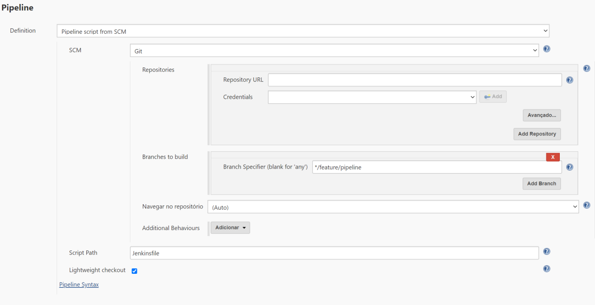
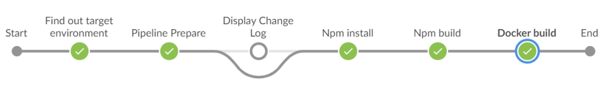

# React - Deno pipeline
The purpose of this project is to demonstrate how to create a pipeline using typescript with [Deno](https://deno.land/). The pipeline is called from [Jenkins](https://www.jenkins.io/), but the same approach can be used to execute the pipeline from any CI/CD tool. The main objective of this approach is to create pipelines that are easier to understand and maintain. It also allows to execute the pipeline without any CI/CD tool. This way, we can test if the typescript pipeline works prior to submit it to be executed by Jenkins. 

The entire typescript pipeline is executed inside a docker container. This way, the Jenkins server is isolated and we can embed all the necessary tools to compile and deploy our project into a docker image. In this case, I'm using the public docker image `tezine/tinyos` . `Tinyos` provides the following tools for our pipeline: deno, git, node, npm, curl, docker, terraform, aws cli, gradle, openjdk11 and kubectl. 

This sample project contains a basic React application that is deployed into a Kubernetes cluster, by executing the following stages through the pipeline: 

1. Git clone: Optional, only executed when called from command line.
2. Npm Install: Installs all dependencies of our React application.
3. Npm build: Builds the React app.
4. Docker login: Login into the Docker Registry to publish a new image
5. Docker build: Generates the Docker image from the compiled React app. 
6. Docker publish: Publishes the compiled React app, which includes node and nginx to docker registry.  
7. Apply to the Kubernetes cluster: Apply the [kubernetes.yaml](kubernetes.yaml) with our React application into the Kubernetes cluster. Includes a Load balancer. 

Here is the final result of the Jenkinsfile: 

<details>
  <summary>Click to expand</summary>

```groovy
#!groovy
def pipelineScript= 'docker run -v /var/run/docker.sock:/var/run/docker.sock:rw -v "$(pwd)":/home/deno --entrypoint= tezine/tinyos deno run --unstable --quiet -A /home/deno/pipeline.ts '
def shouldDeploy = false
String targetEnvironment
String targetEnvironmentAccount
String targetEnvironmentSlaveRole

final Constants = [
        applicationName : "Awesome",
        supportTeamEmail: "hello@you.com",
        sharedAgent     : "myAgent",
        branchMap       : [
                prod: { String branchName -> branchName ==~ /master/ },
                qual: { String branchName -> branchName ==~ /(?i)release\/.*/ },
                devl: { String branchName -> branchName ==~ /develop/ || branchName ==~ /(?i)feature\/.*/ },
        ],
        slaveAccounts   : [
                roleName: "myRole",
                devl    : "tbd",
                qual    : "tbd",
                cert    : "tbd",
                prod    : "tbd"
        ]
]

pipeline {
    agent none
    options {
        buildDiscarder(logRotator(numToKeepStr: "7"))
        timestamps()
        ansiColor("xterm")
    }

    stages {
        stage("Find out target environment") {
            steps {
                script {
                    targetEnvironment = Constants.branchMap.entrySet().find {it.value.call(env.BRANCH_NAME)}?.key
                    shouldDeploy = targetEnvironment != null
                    targetEnvironmentAccount = targetEnvironment != null ? Constants.slaveAccounts[targetEnvironment] : null
                    targetEnvironmentSlaveRole = targetEnvironmentAccount != null ? "yourRole" : null
                    echo "Should Deploy ? ${shouldDeploy}"
                }
            }
        }

        stage("Pipeline Prepare") {
            agent { label Constants.sharedAgent }
            steps {
                pipelinePrepareJDF(Constants.applicationName, Constants.supportTeamEmail)
            }
        }

        stage("Display Change Log") {
            agent { label Constants.sharedAgent }
            when { branch "master" }
            steps {
                displayGitChangeLogJDF(this)
            }
        }

        stage('Npm install') {
            agent { label Constants.sharedAgent }
            steps {
                sh "${pipelineScript} prodJenkins npmInstall"
            }
        }

        stage('Npm build') {
            agent { label Constants.sharedAgent }
            steps {
                sh "${pipelineScript} prodJenkins npmBuild"
            }
        }

        stage('Docker build') {
            agent { label Constants.sharedAgent }
            steps {
                sh "${pipelineScript} prodJenkins dockerBuild 1.0.0"
            }
        }

    }

    post {
        always { sendResultsNotificationJDF(this) }
        success { serviceNowCloseTaskJDF(this, "successful", "Deployment Completed Successfully") }
        unsuccessful { serviceNowCloseTaskJDF(this, "unsuccessful", "Deployment Failed") }
    }
}    
```
</details>

As described in the Jenkinsfile above, the actual pipeline is executed by typescript defined in [pipeline.ts](pipeline.ts). Since it's a pure typescript file, it's easier to add functions and have more "control" and "readability" of what's actually happening in the pipeline. Deno provides a standard library where you have functions to handle files, directories, networking and so on. You can find more info about it [here](https://deno.land/manual) and its Standard Library documentation is [here](https://doc.deno.land/https/github.com/denoland/deno/releases/latest/download/lib.deno.d.ts). You can even test the pipeline.ts from your local machine without using Jenkins to test if it's working.  Take a look at [pipeline.cmd](pipeline.cmd) to check all the options you can use. 

This project uses [TinyOS](https://hub.docker.com/repository/docker/tezine/tinyos) as container image to do all the work. The compilation and deployment is handled inside a TinyOS container. You can find more info about TinyOS and how to create your own custom docker image with the tools you need [here](https://github.com/b12-144/TinyOS). 

If you'd like to test this Jenkins pipeline/Typescript pipeline in your own Jenkins server, just set "Pipeline from SCM" and credentials from "Jenkins API Token" as the image below: 



After the pipeline is executed by Jenkins, you'll get something similar to the image below in your Jenkins BlueOcean: 




AWS users can get more benefits in using this approach, since AWS provides a [CDK](https://aws.amazon.com/pt/cdk/) where is possible to create infrastructure from typescript. Take a look in a Terraform sample [here](https://github.com/hashicorp/terraform-cdk/blob/master/docs/getting-started/typescript.md). 

Enjoy! :heart: